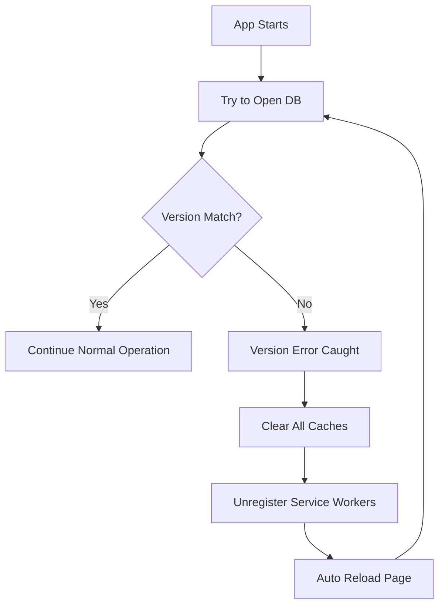

# Database Version Management Guide

## Overview

This document explains how the Medical Companion PWA handles database versioning and prevents version mismatch errors that can occur during development and deployment.

## The Version Mismatch Problem

### What Happens

```
Error: VersionError: The requested version (2) is less than the existing version (4)
```

This error occurs when:
1. **Old cached JavaScript** tries to open the database with an older version number
2. **The actual IndexedDB** in the browser is already at a newer version
3. **IndexedDB refuses** to downgrade (security feature)

### Why It Happens

In layman's terms: It's like trying to use an old key (version 2) on a upgraded lock (version 4).

**Common Causes:**
- Browser caches old JavaScript files
- Service Worker serves outdated code
- Multiple dev server instances with different versions
- Hot Module Replacement (HMR) conflicts in development

## Solution Architecture

### 1. Centralized Version Management

All version numbers are managed in a single file:

```typescript
// src/utils/db/version.ts
export const DB_VERSION = 4;
export const CACHE_VERSION = 'v4';
export const DB_NAME = 'MedCompanionDB';
```

### 2. Automatic Migration Handler

The `DatabaseMigrationHandler` automatically handles version mismatches:

```typescript
// src/utils/db/migration.ts
- Detects version mismatch errors
- Clears all caches automatically
- Reloads the page with fresh code
- No user intervention required
```

### 3. How It Works



## Development Environment

### Preventing Issues

1. **Use single dev server instance**
   - Kill old servers before starting new ones
   - Check for ports already in use

2. **Clear cache when switching branches**
   ```javascript
   // Run in browser console
   await caches.delete('med-companion-v4');
   await indexedDB.deleteDatabase('MedCompanionDB');
   location.reload();
   ```

3. **Use the cache clear utility**
   - Navigate to: `http://localhost:5176/clear-cache.html`

## Production Deployment

### Docker Deployment (Safe ✅)

**Why it's safe:**
- Fresh container = no old cache
- Consistent environment
- No version conflicts on initial deployment

**Potential Issues:**
- **During updates**: Users with cached old version
- **Solution**: Our migration handler auto-fixes this

### Deployment Best Practices

1. **Version Bumping Protocol**

   When changing database schema:
   ```bash
   1. Update src/utils/db/version.ts
   2. Update public/sw.js (both DB version and cache name)
   3. Update migration logic if needed
   4. Test locally with cache clear
   5. Deploy
   ```

2. **Service Worker Update Strategy**

   ```javascript
   // public/sw.js
   self.addEventListener('activate', event => {
     // Clear old caches on activation
     event.waitUntil(
       caches.keys().then(cacheNames => {
         return Promise.all(
           cacheNames
             .filter(name => name !== CACHE_NAME)
             .map(name => caches.delete(name))
         );
       })
     );
   });
   ```

3. **User Communication**

   If manual refresh needed:
   ```typescript
   // Automatic notification to users
   if ('serviceWorker' in navigator) {
     navigator.serviceWorker.ready.then(registration => {
       registration.showNotification('Update Available', {
         body: 'Please refresh for the latest version',
         icon: '/icon-192.png'
       });
     });
   }
   ```

## Production Monitoring

### Error Tracking

Add to your error monitoring:

```javascript
window.addEventListener('error', (event) => {
  if (event.error?.name === 'VersionError') {
    // Log to monitoring service
    console.error('Version mismatch detected:', {
      requested: extractRequestedVersion(event.error.message),
      existing: extractExistingVersion(event.error.message),
      userAgent: navigator.userAgent,
      timestamp: new Date().toISOString()
    });
  }
});
```

### Metrics to Track

1. **Version mismatch frequency**
2. **Auto-recovery success rate**
3. **Time to recovery**
4. **Affected users count**

## User Impact & Recovery

### What Users Experience

1. **First time**: Page auto-reloads once (1-2 seconds)
2. **Subsequent visits**: Works normally
3. **No data loss**: IndexedDB data persists

### Manual Recovery (If Auto-Fix Fails)

Users can manually fix by:

1. **Hard Refresh**
   - Windows/Linux: `Ctrl + Shift + R`
   - Mac: `Cmd + Shift + R`

2. **Clear Site Data**
   - Chrome DevTools → Application → Clear Storage
   - Click "Clear site data"

3. **Use Clear Cache Page**
   - Navigate to `/clear-cache.html`

## Testing Version Migrations

### Local Testing Steps

1. **Simulate Old Version**
   ```javascript
   // Temporarily edit src/utils/db/version.ts
   export const DB_VERSION = 2; // Old version
   ```

2. **Build and serve**
   ```bash
   npm run build
   npm run preview
   ```

3. **Create some data**
   - Add topics, findings, etc.

4. **Simulate Update**
   ```javascript
   // Change back to new version
   export const DB_VERSION = 4; // New version
   ```

5. **Rebuild and test**
   - Should auto-clear cache and reload

### Automated Testing

```typescript
// test/db-migration.test.ts
describe('Database Migration', () => {
  it('should handle version mismatch gracefully', async () => {
    // Mock IndexedDB with version 4
    const mockDB = createMockDB(4);

    // Try to open with version 2
    const error = new Error('VersionError');
    error.name = 'VersionError';

    // Should clear cache and reload
    await DatabaseMigrationHandler.handleVersionMismatch(error);

    expect(caches.delete).toHaveBeenCalled();
    expect(window.location.reload).toHaveBeenCalled();
  });
});
```

## Summary

### For Developers

- Version mismatches are **automatically handled**
- No manual intervention needed
- Clear cache when switching branches

### For DevOps

- Docker deployments start fresh (safe)
- Updates might trigger auto-refresh for users
- Monitor version mismatch errors

### For Users

- Worst case: Page refreshes once
- No data loss
- Transparent recovery

## Related Files

- `src/utils/db/version.ts` - Version constants
- `src/utils/db/migration.ts` - Migration handler
- `src/utils/db/database.ts` - Database initialization
- `public/sw.js` - Service worker
- `public/clear-cache.html` - Manual cache clear utility

---

*Last Updated: January 2025*
*Maintained by: Development Team*